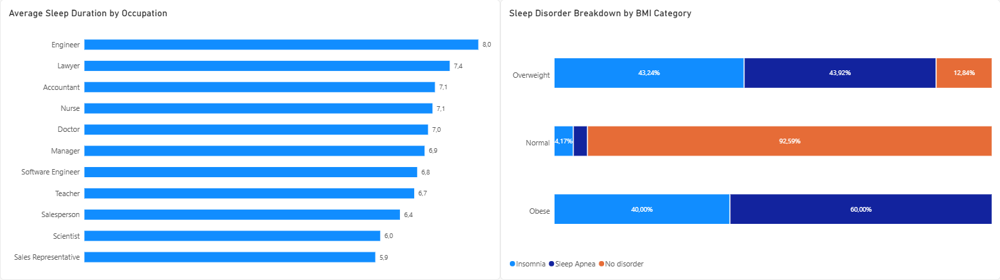

# 💤 Sleep Health & Lifestyle Analytics (SQL + Power BI)

## 📌 Project Overview
This project presents an **end-to-end data analysis pipeline** exploring the relationship between sleep quality, occupation, and health metrics (BMI, stress levels, sleep disorders).

The goal was to transform raw tabular data into actionable business insights using **PostgreSQL** for data cleaning and aggregation, followed by an executive dashboard built in **Power BI** to visualize key dependencies.

---

## 📊 Key Insights & Business Findings
- **High Risk in Overweight/Obese Groups:** 100% stacked visual analysis revealed that obesity and overweight categories have a significantly higher prevalence of sleep disorders (Insomnia and Sleep Apnea) compared to the normal weight group.
- **Occupational Disparities:** **Engineers** enjoy the highest average sleep duration (~7.99 hours/day), whereas **Sales Representatives** suffer from the lowest sleep duration (~5.90 hours/day).
- **Stress Level Impact:** Higher self-reported stress levels strongly correlate with reduced sleep efficiency and increased sleep disorder rates.

---

## 🛠️ Tech Stack & Methodology
- **Database Engine:** PostgreSQL
- **BI & Visualization:** Power BI Desktop
- **Data Transformation:** Power Query, SQL Views
- **Concepts Applied:** SQL Aggregations, GROUP BY, Data Type Conversions, Relational Data Modeling, 100% Stacked Bar/Column Charts.

---

## 🗄️ Database Architecture & SQL Views

The analysis was performed using modular database views created in PostgreSQL to separate data preparation from visualization logic.

### 1. Occupation vs. Sleep Summary View
Calculates average sleep duration, physical activity, and stress metrics grouped by occupation.


```sql
CREATE VIEW v_occupation_sleep_summary AS
SELECT 
    occupation,
    ROUND(AVG(sleep_duration)::numeric, 2) AS average_sleep_duration,
    ROUND(AVG(quality_of_sleep)::numeric, 2) AS average_sleep_quality,
    ROUND(AVG(physical_activity_level)::numeric, 2) AS average_activity_level,
    ROUND(AVG(stress_level)::numeric, 2) AS average_stress_level,
    COUNT(*) AS total_respondents
FROM sleep_health
GROUP BY occupation
ORDER BY average_sleep_duration DESC;
```
2. BMI vs. Sleep Disorders View
Aggregates the occurrence of sleep disorders across different BMI categories.
```
SQL
CREATE VIEW v_health_sleep_disorders_summary AS
SELECT 
    bmi_category,
    COUNT(CASE WHEN sleep_disorder = 'Insomnia' THEN 1 END) AS insomnia_count,
    COUNT(CASE WHEN sleep_disorder = 'Sleep Apnea' THEN 1 END) AS sleep_apnea_count,
    COUNT(CASE WHEN sleep_disorder IS NULL OR sleep_disorder = 'None' THEN 1 END) AS no_disorder_count,
    COUNT(*) AS total_category_count
FROM sleep_health
GROUP BY bmi_category;
```
📈 Power BI Dashboard Highlights
The interactive dashboard includes two primary visuals designed for executive reporting:

Average Sleep Duration by Occupation (Clustered Bar Chart): Sorted descending to quickly highlight best and worst performing professions.

Sleep Disorder Breakdown by BMI Category (100% Stacked Bar Chart): Normalized to show proportions and eliminate sample size bias across weight categories.


```
📁 Repository Structure
├── data/
│   └── Sleep_health_and_lifestyle_dataset.csv
├── sql/
│   └── create_views.sql
├── powerbi/
│   └── Sleep_Health_Analytics.pbix
└── README.md
```
👨‍💻 Author
Daniel Żebrowski

Aspiring Data Analyst | SQL, Power BI & Python

LinkedIn: Daniel Żebrowski

GitHub: @DanielZebrowski-Data
